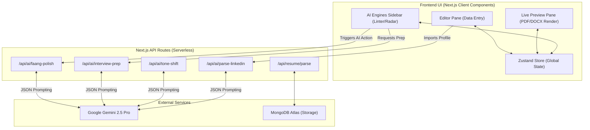

<div align="center">
  
  <h1>🚀 ResumeAI: Enterprise-Grade FAANG AI Resume Builder</h1>
  <p><strong>A Next-Generation, AI-powered career hub designed to engineer professional, ATS-friendly, FAANG-level resumes in minutes.</strong></p>
  
  [](https://nextjs.org/)
  [](https://www.typescriptlang.org/)
  [](https://tailwindcss.com/)
  [](https://zustand-demo.pmnd.rs/)
  [](https://ai.google.dev/)
</div>

<br/>

ResumeAI is a modern, full-stack application built with Next.js 16. It leverages cutting-edge Artificial Intelligence (Google Gemini 2.5) to automatically generate, format, and optimize your CV to pass strict legacy Applicant Tracking Systems (ATS) and impress highly technical recruiters.

---

## ⚙️ How the Engine Works

ResumeAI is not just a text editor; it is a pipeline of intelligent engines working together to craft your career narrative.

1. **Ingestion Engine**: You can upload a PDF or paste your raw LinkedIn profile. The parser extracts the text and maps it perfectly into a strict internal JSON schema.
2. **Analysis & Scoring**: As you type, the `LinterService` runs locally in your browser. It scans every bullet point for:
   - 🔴 **Weak Verbs** (e.g., "helped", "worked")
   - 🟢 **Missing Metrics** (ensuring you quantify your impact)
   - 🟡 **Corporate Buzzwords** (e.g., "synergy", "ninja")
   - 🔵 **Punctuation Consistency**
3. **AI Persona Rewriting**: You select a psychological tone (Aggressive, Analytical, or Collaborative). The app communicates securely with Gemini 2.5 to rewrite your entire JSON state to match that persona.
4. **Rendering & Export**: The engine takes the state and perfectly renders it onto an A4 boundary, ensuring 100% legacy ATS compatibility via high-fidelity PDF or native `.docx` export.

---

## 🌟 Next-Gen FAANG Features

- **FAANG Polish (Nuclear Option)**: A one-click structural overhaul that rewrites your bullet points using the strict Action-Verb + Quantified Impact + Tech Stack format expected by top-tier tech companies.
- **Mock Interview Prep Engine**: Automatically analyzes the claims in your resume and generates 5 highly aggressive, tailored behavioral/technical interview questions to grill you.
- **Psychological Tone Dial**: An interactive slider that seamlessly rewrites your entire resume to project an "Aggressive", "Analytical", or "Collaborative" persona depending on the target corporate culture.
- **Career Velocity Radar**: A live, animated Recharts radar that scores your resume's Impact, Technical Depth, Leadership, and Clarity against synthetic FAANG benchmarks.
- **Anti-Bias "Blind Mode"**: Instantly redact your name, email, specific university names, and company names to generate an anonymized resume for unbiased screening.

---

## 🏗️ System Architecture



---

## 💻 Tech Stack

- **Framework**: [Next.js 16](https://nextjs.org) (App Router, Turbopack)
- **Styling**: [Tailwind CSS](https://tailwindcss.com/) & [Framer Motion](https://www.framer.com/motion/)
- **State Management**: [Zustand](https://zustand-demo.pmnd.rs/) (Local storage persistence)
- **Database**: [MongoDB](https://www.mongodb.com/) via [Mongoose](https://mongoosejs.com/)
- **Authentication**: [NextAuth.js](https://next-auth.js.org/)
- **AI Core**: [Google Generative AI (Gemini 2.5)](https://ai.google.dev/) 
- **Document Generation**: `docx` library & React-to-Print

---

## 🚀 Getting Started

### Prerequisites

Make sure you have Node.js (v18+) and npm installed. You will also need a MongoDB database cluster (e.g., MongoDB Atlas) and an API key for Google Gemini.

### Installation

1. **Clone the repository:**
   ```bash
   git clone https://github.com/Ayush-kathil/resume-builder.git
   cd resume-builder
   ```

2. **Install dependencies:**
   ```bash
   npm install
   ```

3. **Environment Setup:**
   Create a `.env.local` file in the root directory:
   ```env
   # Database Configuration
   MONGODB_URI=your_mongodb_connection_string

   # Authentication (NextAuth)
   NEXTAUTH_SECRET=your_secure_random_string
   NEXTAUTH_URL=http://localhost:3000

   # AI Provider Keys
   GEMINI_API_KEY=your_gemini_api_key
   ```

4. **Run the Development Server:**
   ```bash
   npm run dev
   ```
   *Open [http://localhost:3000](http://localhost:3000) with your browser to see the application.*

---

## 🤝 Contributing
Contributions are always welcome! Whether it's reporting a bug, discussing improvements, or submitting a Pull Request, your input is valued.

## 📄 License
This project is licensed under the MIT License.